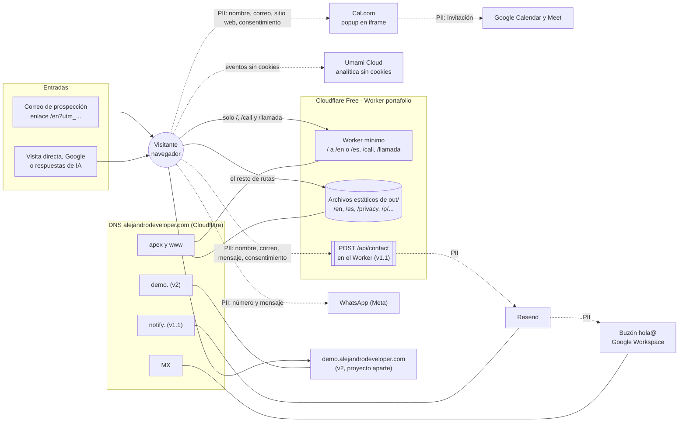
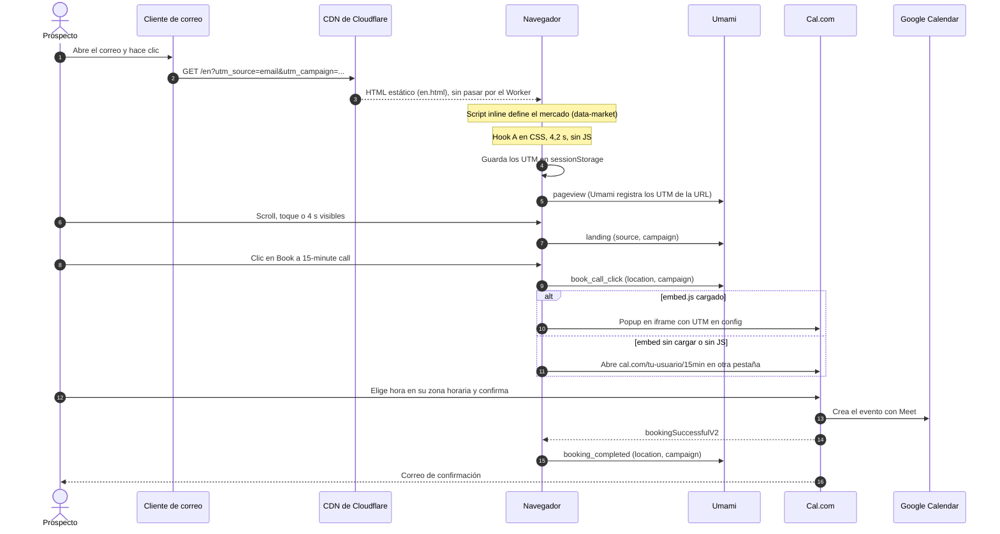
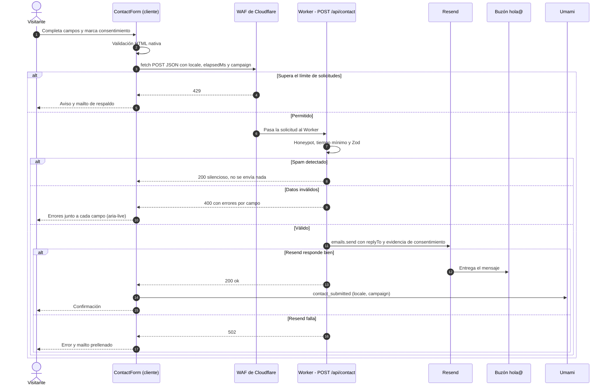
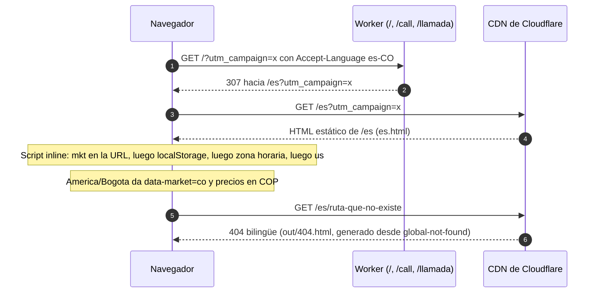

# 03 · Arquitectura

El portafolio es un sitio **100 % estático**. Next.js lo exporta a `out/` y Cloudflare lo sirve desde su CDN, en el plan gratuito. La v1 solo ejecuta código de servidor en un Worker mínimo, que resuelve tres redirecciones: `/` según el idioma del navegador, `/call` y `/llamada`. La v1.1 agrega a ese Worker el formulario (`POST /api/contact`).

Todo lo dinámico vive en terceros:

- **Cal.com** para la agenda.
- **Resend** para el correo del formulario.
- **WhatsApp** para mensajes.
- **Umami Cloud** para la medición.

---

## 1. Diagrama de contexto y enrutamiento

Las líneas punteadas marcan flujos de datos. Las que dicen **PII** transportan datos personales. Esta misma lista de terceros alimenta la sección de encargados de la [política de privacidad](./09-seguridad-y-privacidad.md#6-privacidad-y-cumplimiento).



**Lectura rápida.** El visitante casi siempre toca solo la CDN de Cloudflare. El Worker entra en juego únicamente en `/`, en los enlaces cortos y, desde la v1.1, en el formulario. Fuera de eso, el visitante solo sale del sitio cuando agenda (Cal.com), escribe (WhatsApp o el formulario) o abre la demo. La analítica de Umami no usa cookies ni recoge datos personales ([Umami](https://umami.is/pricing)).

## 2. Secuencias principales

### 2.1 Del correo a la llamada agendada (v1)



### 2.2 Formulario de contacto (v1.1)



### 2.3 Resolución de idioma, mercado y 404



## 3. Estrategia de render por ruta

| Ruta | Render | Caché | Notas |
|---|---|---|---|
| `/` | Redirección 307 en el Worker | Sin caché (`no-store`) | `es…` en `Accept-Language` → `/es`; lo demás → `/en`; conserva el query string ([04 §2](./04-i18n-contenido-y-precios.md#2-redirección-de-)) |
| `/en`, `/es` | SSG exportado (`en.html`, `es.html`) | CDN | La página única |
| `/en/privacy`, `/es/privacy` | SSG exportado | CDN | Política por idioma (TSX) |
| `/en/p/[slug]`, `/es/p/[slug]` (v1.1) | SSG con `generateStaticParams` y `dynamicParams = false` | CDN | `noindex` + `X-Robots-Tag` (vía `_headers`); un slug desconocido da 404 |
| `/call`, `/llamada` | Redirección 307 externa en el Worker | Sin caché | Hacia `cal.com/tu-usuario/15min`, conserva los UTM |
| `/api/contact` (v1.1) | Endpoint del Worker | Sin caché | Única parte dinámica |
| `/sitemap.xml`, `/robots.txt` | Estáticos (`sitemap.ts`, `robots.ts` con `dynamic = 'force-static'`) | CDN | Sin `/p/*` |
| Cualquier otra | `out/404.html`, generado desde `global-not-found.tsx` (flag experimental) y servido con estado 404 | CDN | 404 bilingüe ([ADR-013](./14-decisiones.md#adr-013)) |

**Por qué no hay `proxy.ts`.** El export estático no lo soporta ([Next.js](https://nextjs.org/docs/app/guides/static-exports)), y Next 16 lo recomienda como último recurso. Además, `dynamicParams = false` en el layout `[locale]` impide el patrón `[...rest]` para el 404 localizado ([issue #87738](https://github.com/vercel/next.js/issues/87738)). Ver [ADR-002](./14-decisiones.md#adr-002) y [ADR-004](./14-decisiones.md#adr-004).

## 4. Estructura del repositorio

`Code/` será la raíz del repositorio Git. En Workers Builds, el directorio raíz queda en `/`.

```text
Code/
├── docs/                          # esta propuesta
├── public/
│   ├── _headers                   # encabezados de seguridad, caché y noindex (Cloudflare, 09 §2)
│   ├── images/
│   │   ├── mrb/                   # antes/después en WebP (ver 06 §4)
│   │   ├── about/                 # retrato 800×800
│   │   └── demo/                  # póster de la tienda demo (v2)
│   └── og/                        # og-en.png, og-es.png (1200×630)
├── src/
│   ├── app/
│   │   ├── [locale]/
│   │   │   ├── layout.tsx         # root layout: <html lang>, fuente, script de mercado, analítica, TrackingListener
│   │   │   ├── page.tsx           # la página única: compone las secciones
│   │   │   ├── privacy/page.tsx   # política por idioma
│   │   │   └── p/[slug]/          # propuestas (v1.1)
│   │   │       ├── page.tsx
│   │   │       └── opengraph-image.tsx
│   │   ├── global-not-found.tsx   # 404 bilingüe → out/404.html
│   │   ├── globals.css            # Tailwind + tokens (@theme)
│   │   ├── sitemap.ts
│   │   ├── robots.ts
│   │   └── icon.svg
│   ├── components/
│   │   ├── sections/              # Header, Hero, Solves, CaseMrb, DemoTeaser (v2), Process, Pricing, Faq, About, Closing, Footer
│   │   ├── hero/                  # HookStage.tsx + hook.css
│   │   ├── ui/                    # ButtonLink, Container, SectionHeading, Price, Icon
│   │   ├── booking/               # BookCallLink (servidor) + CalLoader (cliente)
│   │   ├── analytics/             # TrackingListener (cliente)
│   │   ├── market/                # MarketToggle (cliente)
│   │   └── contact/               # ContactForm (cliente, v1.1)
│   ├── content/
│   │   ├── types.ts               # SiteContent, Proposal, PriceSpec…
│   │   ├── en.ts / es.ts          # todos los textos visibles
│   │   ├── site.ts                # configuración: flags, enlaces, datos de contacto, ID de Umami
│   │   └── proposals/             # un archivo .ts por propuesta (v1.1)
│   └── lib/
│       ├── i18n.ts                # locales, currentLocale() y getContent() (next/root-params; solo servidor)
│       ├── fonts.ts               # fuente con next/font, compartida por el layout y el 404
│       ├── market.ts              # script inline y formato de moneda
│       ├── analytics.ts           # nombres de eventos (tipo unión) y track() sobre Umami
│       ├── utm.ts                 # captura y lectura de UTM
│       └── jsonld.ts              # constructores tipados con schema-dts
├── worker/
│   ├── index.ts                   # redirecciones de /, /call y /llamada; en v1.1 enruta /api/contact
│   ├── contact.ts                 # formulario (v1.1)
│   ├── tsconfig.json              # tipos del runtime de Cloudflare, separados de los del navegador
│   └── worker-configuration.d.ts  # generado con `pnpm cf-typegen`; se commitea
├── next.config.ts                 # output: 'export', imágenes sin optimizador, flag globalNotFound
├── wrangler.jsonc                 # Worker, archivos de out/, dominio y rutas que pasan por el Worker
├── CLAUDE.md                      # reglas para agentes (ver README); importa AGENTS.md
├── AGENTS.md                      # reglas de Next para agentes; `next dev` lo mantiene
├── .nvmrc                         # 24
├── package.json / pnpm-lock.yaml / pnpm-workspace.yaml   # este último aprueba los scripts de instalación (pnpm 12)
├── tsconfig.json / eslint.config.mjs / postcss.config.mjs / .prettierrc / .prettierignore
└── .dev.vars.example              # (v1.1) RESEND_API_KEY para `wrangler dev`; .dev.vars va en .gitignore
```

## 5. Componentes de servidor y de cliente

Todo es Server Component salvo **4 islas de cliente**, todas pequeñas y sin dependencias:

| Componente | Tipo | Responsabilidad | Carga |
|---|---|---|---|
| `TrackingListener` | Cliente | Un listener de clics en fase de captura que lee `data-track`; IntersectionObserver para `data-track-view`; captura de UTM y evento `landing` ([12 §4](./12-medicion-y-analitica.md#4-implementación)) | Tras la hidratación |
| `CalLoader` | Cliente | Carga `embed.js` de Cal.com en idle o con la primera intención; registra `bookingSuccessfulV2` ([07 §2](./07-integraciones.md#2-agenda-con-calcom)) | Diferida |
| `MarketToggle` | Cliente | Botones USD/COP: guarda en `localStorage` y cambia `html[data-market]` ([04 §8](./04-i18n-contenido-y-precios.md#8-precios-por-país-del-visitante)) | Tras la hidratación |
| `ContactForm` (v1.1) | Cliente | Estados del formulario y `fetch` a `/api/contact` | Tras la hidratación |
| Script de mercado | Script inline en `<head>` | Decide `data-market` antes del primer pintado. No es un componente de React | Bloqueante, ~300 B |

Las CTAs, enlaces y textos se renderizan en el servidor como `<a>` reales con atributos `data-*`. Funcionan sin JavaScript y no agregan JS por botón.

## 6. Rutas, encabezados y configuración

Con el export estático, `next.config.ts` ya no maneja redirecciones ni encabezados ([ADR-017](./14-decisiones.md#adr-017)). Esa responsabilidad se reparte así:

| Archivo | Contenido | Doc |
|---|---|---|
| `next.config.ts` | `output: 'export'`; `images.unoptimized: true`; `experimental.globalNotFound: true` | [06 §4](./06-secciones-y-ui.md#4-imágenes), [ADR-013](./14-decisiones.md#adr-013) |
| `worker/index.ts` | `/` por `Accept-Language`; `/call` y `/llamada` hacia Cal.com; desde la v1.1, `/api/contact` | [04 §2](./04-i18n-contenido-y-precios.md#2-redirección-de-), [07 §5](./07-integraciones.md#5-formulario-de-contacto-v11) |
| `public/_headers` | Encabezados de seguridad; CSP Report-Only; caché inmutable de `/_next/static/*`; `X-Robots-Tag` para `/p/*` y para las URL de `workers.dev` | [09 §2](./09-seguridad-y-privacidad.md#2-encabezados-http), [08 §6](./08-seo.md#6-noindex-de-propuestas-y-demo) |
| `wrangler.jsonc` | Nombre del Worker, carpeta `out/`, 404, rutas que pasan primero por el Worker y dominio | [10 §6](./10-infraestructura-y-entornos.md#6-cloudflare) |

```ts
// next.config.ts (extracto)
const nextConfig: NextConfig = {
  output: 'export',              // `next build` genera out/ con HTML, CSS, JS e imágenes
  images: { unoptimized: true }, // el export no incluye optimizador; las imágenes llegan optimizadas (06 §4)
  experimental: { globalNotFound: true },
}
```

```jsonc
// wrangler.jsonc — se commitea ANTES de conectar Workers Builds: sin este archivo,
// Cloudflare autoconfigura el proyecto con vinext y abre un PR
{
  "$schema": "node_modules/wrangler/config-schema.json",
  "name": "web-portfolio",
  "main": "worker/index.ts",
  "compatibility_date": "2026-10-01",
  "assets": {
    "directory": "./out",
    "binding": "ASSETS",
    "not_found_handling": "404-page",       // sirve out/404.html con estado 404
    "html_handling": "auto-trailing-slash", // /en → en.html
    "run_worker_first": ["/", "/call", "/llamada"] // v1.1: + "/api/*"
  },
  "routes": [{ "pattern": "alejandrodeveloper.com", "custom_domain": true }],
  "workers_dev": false, // la URL workers.dev de producción no envía noindex
  "preview_urls": true  // previews por rama en workers.dev, con noindex
}
```

- **Solo las rutas de `run_worker_first` ejecutan el Worker** y cuentan para las 100.000 invocaciones diarias del plan Free. El resto lo sirven los archivos estáticos, gratis y sin límite ([Cloudflare](https://developers.cloudflare.com/workers/static-assets/billing-and-limitations/)).
- **`www` → apex no va aquí.** Se configura en Cloudflare como una Redirect Rule 308 ([10 §6](./10-infraestructura-y-entornos.md#6-cloudflare)).
- **No se activa Workers Cache.** Si se activa, las solicitudes a archivos estáticos pasan a cobrarse ([Cloudflare](https://developers.cloudflare.com/workers/cache/)).

## 7. Convenciones de código

- **Idioma:** código, identificadores, commits y comentarios en inglés; docs en español; textos visibles solo en `src/content/{en,es}.ts`.
- **Nombres:** componentes en `PascalCase.tsx`; utilidades en `kebab-case.ts`; alias de import `@/` hacia `src/`.
- **Estilos:** utilidades de Tailwind. Las únicas excepciones son `hero/hook.css` (keyframes) y los tokens de `globals.css`. Nada de estilos inline salvo las variables CSS del hook (`--t`, `--d`).
- **Enlaces internos con `<a>`, no con `next/link`.** En el export de Next 16, el prefetch de `next/link` pide los payloads RSC en rutas equivocadas y da 404 ([issue #85374](https://github.com/vercel/next.js/issues/85374)). Entre páginas estáticas, un `<a>` es igual de rápido. Por eso la regla de ESLint `@next/next/no-html-link-for-pages` está desactivada en `eslint.config.mjs`.
- **Datos de seguimiento:** toda CTA lleva `data-track` y `data-track-location`, con valores de la unión de tipos en `lib/analytics.ts`, para evitar errores de tipeo.
- **Commits:** [Conventional Commits](https://www.conventionalcommits.org/) (`feat:`, `fix:`, `docs:`…). Ramas cortas y un PR por tarea del [plan](./13-plan-de-implementacion.md), para tener una preview de Cloudflare por cada una.
- **Decisiones:** si una tarea cambia una decisión de [14](./14-decisiones.md), se actualiza el ADR en el mismo PR.

## 8. Cómo crece

- **v1.1:** se agregan `worker/contact.ts`, `ContactForm`, la ruta `p/[slug]` y `content/proposals/`, y `/api/*` entra en `run_worker_first`. Aparece el primer secreto (`RESEND_API_KEY`), como secreto del Worker.
- **v2:** `DemoTeaser` + `features.demoStore = true`. La demo vive en otro proyecto, con su hosting definido en sus propios docs ([07 §6](./07-integraciones.md#6-tienda-demo-v2-contrato-de-integración)).
- **v3:** una ruta `/[locale]/diagnostico` (o `/audit`) con su endpoint en el Worker y una base de datos para los leads, por ejemplo D1 de Cloudflare o Neon ([07 §7](./07-integraciones.md#7-v3-esbozo-del-diagnóstico-automático-hook-c)).

## Fuentes

- [Next.js: internacionalización](https://nextjs.org/docs/app/guides/internationalization)
- [`next/root-params`](https://nextjs.org/docs/app/api-reference/functions/next-root-params)
- [Next.js: export estático](https://nextjs.org/docs/app/guides/static-exports)
- [`proxy.js`](https://nextjs.org/docs/app/api-reference/file-conventions/proxy)
- [`not-found` y `global-not-found`](https://nextjs.org/docs/app/api-reference/file-conventions/not-found)
- [Issue #87738](https://github.com/vercel/next.js/issues/87738)
- [Issue #85374](https://github.com/vercel/next.js/issues/85374)
- [Cloudflare: static assets y `run_worker_first`](https://developers.cloudflare.com/workers/static-assets/binding/)
- [Cloudflare: precios y límites de static assets](https://developers.cloudflare.com/workers/static-assets/billing-and-limitations/)
- [Cloudflare: configuración automática de Workers Builds](https://developers.cloudflare.com/workers/framework-guides/automatic-configuration/)
- [Umami: precios y privacidad](https://umami.is/pricing)

Consultadas el 3-oct-2026; hosting y analítica, el 4-oct-2026.
