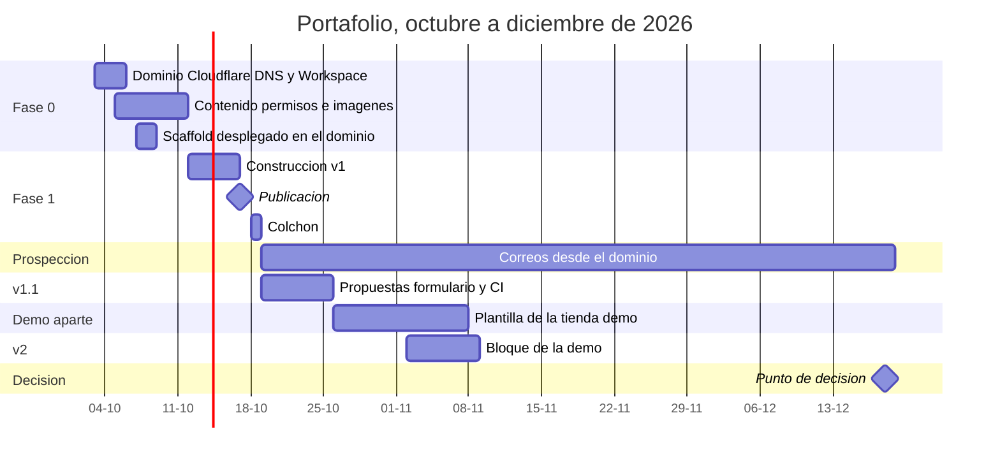
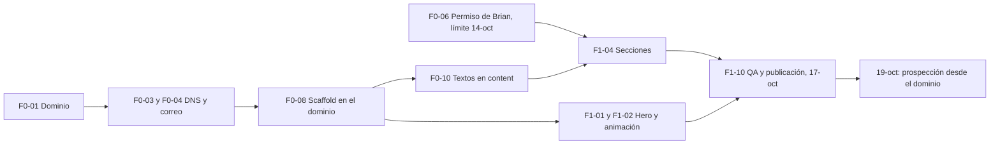

# 13 · Plan de implementación

La v1 se construye en **~7,5 h**, entre el 12 y el 17 de octubre, y se publica el **17**; el 18 queda de colchón. Para lograrlo, la fase 0 adelanta todo lo que no es construir: dominio, DNS, correo, scaffold desplegado, Cal.com y textos. Esto suma unas 3 h a la fase 0, pero deja la semana del festivo libre para el hero y las secciones.

Después vienen:

- **v1.1 (19–25 de octubre):** propuestas web, formulario y CI.
- **v2 (2–8 de noviembre):** el bloque de la tienda demo.
- **v3:** opcional, después del 18 de diciembre.

---

## 1. Resumen de fases

| Fase | Fechas | Objetivo | Horas | Entregable |
|---|---|---|---|---|
| 0. Preparación | 3–11 oct | Todo listo para construir sin bloqueos | ~7,5–8,5 (técnicas ~4; contenido ~4–5); ~2 h ideales el 3–4 oct | Dominio con correo autenticado; scaffold en `alejandrodeveloper.com` sobre Cloudflare; Cal.com; textos e imágenes |
| 1. v1 | 12–17 oct (12 festivo) | Publicar | ~7,5 | Sitio publicado con hook A, caso, precios, agenda y SEO |
| 1.1 | 19–25 oct | Herramientas de cierre y calidad | ~4,25 | Propuestas web, formulario, CI, CSP aplicada |
| 2. v2 | 2–8 nov (2 festivo) | Probar en vivo | ~3 | Bloque "Pruébala" + CTA secundario hacia la demo |
| 3. v3 (opcional) | Después del 18-dic | Prospectos entrantes | 10–15 | Diagnóstico automático ([07 §7](./07-integraciones.md#7-v3-esbozo-del-diagnóstico-automático-hook-c)) |

## 2. Calendario

## 3. Presupuesto semanal de horas

El diagnóstico (§8) supone 8–10 h por semana: unas 4 de "prueba" (sitio y demo), 3 de prospección y 2 de cierre y llamadas.

| Semana | Prueba (sitio y demo) | Prospección | Cierre y llamadas | Total | Nota |
|---|---|---|---|---|---|
| 3–4 oct (fin de semana) | Fase 0: ~2 h (dominio, Cloudflare, DNS, Workspace) | — | — | ~2 h | Adelanta el historial del dominio |
| 5–11 oct | Fase 0: ~6–7 h | 1–2 h (seguimientos desde Gmail a los 15 ya contactados) | 2 h (Real Danesa, Jerrell's) | 9–11 h | Pesada por la fase 0 ampliada y el spike del export (F0-08) |
| 12–18 oct | Fase 1: 7,5 h (festivo el 12) | 1 h | 1–2 h | 9,5–10,5 h | La semana más cargada |
| 19–25 oct | v1.1: 4,25 h | 3 h (15 prospectos nuevos) | 2 h | 9,25 h | **La demo no cabe esta semana** |
| 26 oct–1 nov | Demo: 4 h | 3 h | 2 h | 9 h | La demo arranca aquí |
| 2–8 nov | v2: 3 h + demo: 1–2 h (festivo el 2) | 3 h | 2 h | 9–10 h | Publicación de la v2 el 8 |
| 9 nov–18 dic | Mejoras y demo: 4 h | 3 h | 2 h | 9 h | Thanksgiving el 26-nov reduce el trabajo con EE. UU. |

**Riesgo de capacidad.** El diagnóstico ubicaba la demo entre el 12-oct y el 1-nov; aquí solo tiene unas 5–6 h antes de la v2. Si la demo no está lista el 2-nov:

- Se mueven V11-03 y V11-04 (CI y CSP) a noviembre.
- O se publica la v2 con la versión mínima de la demo (catálogo, carrito y pago de prueba, sin cotización con planos).

## 4. Fase 0 (3 al 11 de octubre)

| ID | Tarea | h | Depende de | Listo cuando | Doc |
|---|---|---|---|---|---|
| F0-01 | Cuenta de Cloudflare (plan Free, 2FA) y compra del dominio .com en Cloudflare Registrar, antes del 1-nov (cuando sube el precio), con renovación automática, privacidad WHOIS y bloqueo | 0,25 | — | Dominio activo con DNS en Cloudflare | [10 §2](./10-infraestructura-y-entornos.md#2-dominio) |
| F0-02 | Umami Cloud (Hobby, sitio creado) y repositorio privado en GitHub (raíz = `Code/`) | 0,25 | — | ID de Umami anotado; repositorio creado | [10 §1](./10-infraestructura-y-entornos.md#1-cuentas-y-servicios) |
| F0-03 | Google Workspace: verificación, MX, SPF, DKIM 2048, alias `hola@` y `dmarc@`, 2FA | 0,75 | F0-01 | El correo entra y sale; DKIM autenticando | [10 §4](./10-infraestructura-y-entornos.md#4-google-workspace) |
| F0-04 | DNS restante en Cloudflare: AAAA `www` y Redirect Rule al apex, Resend (`notify.`), Search Console; HSTS y *Always Use HTTPS* | 0,5 | F0-01 | Registros verificados en cada panel | [10 §3](./10-infraestructura-y-entornos.md#3-tabla-dns), [10 §6](./10-infraestructura-y-entornos.md#6-cloudflare) |
| F0-05 | DMARC `p=none` (≥ 48 h después de F0-03) | 0,1 | F0-03 | TXT `_dmarc` publicado | [10 §4](./10-infraestructura-y-entornos.md#4-google-workspace) |
| F0-06 | Pedir a Brian: caso con nombre, cifra de cotizaciones desde el 27-ago, testimonio. **Fecha límite: 14-oct** | 0,25 | — | Correo enviado | [04 §6](./04-i18n-contenido-y-precios.md#6-caso-mrb-con-disclosure) |
| F0-07 | Dirección postal (física, apartado USPS o buzón privado) | variable | — | Dirección definida | [09 §6.3](./09-seguridad-y-privacidad.md#63-estados-unidos-can-spam-y-caloppa) |
| F0-08 | Scaffold desplegado en Cloudflare y spike del export. Detalle debajo de la tabla | 1,25 | F0-02, F0-04 | `https://alejandrodeveloper.com/en` responde con SSL y `noindex`; `/` redirige; el spike pasa | [03](./03-arquitectura.md), [04 §2–3](./04-i18n-contenido-y-precios.md#2-redirección-de-), [10 §6](./10-infraestructura-y-entornos.md#6-cloudflare) |
| F0-09 | Cal.com: cuenta, Calendar y Meet, evento(s) de 15 min, preguntas y consentimiento; confirmar el límite de eventos del plan Free | 0,5 | F0-03 | Reserva de prueba completa | [07 §2.1](./07-integraciones.md#21-configuración-en-calcom-fase-0) |
| F0-10 | Textos EN y ES directamente en `content/{en,es}.ts`: hero, 3 bloques, caso (ambas versiones), proceso, precios, FAQ, sobre mí, cierre, 404 | 2–3 | F0-08 | Compila con todos los textos, sin relleno | [04 §4](./04-i18n-contenido-y-precios.md#4-modelo-de-contenido-tipado), [06 §2](./06-secciones-y-ui.md#2-contenido-por-sección) |
| F0-11 | Imágenes: capturas de MRB (archive.org y sitio nuevo), retrato, OG en EN y ES | 1 | — | Archivos con las medidas de 06 §4 | [06 §4](./06-secciones-y-ui.md#4-imágenes) |
| F0-12 | Producto y marca ficticios verificados | 0,25 | — | Nombre elegido; búsquedas sin coincidencias | [05 §12](./05-hero-animacion.md#12-producto-y-marca-ficticios) |
| F0-13 | WhatsApp Business (perfil, saludo) | 0,25 | — | Perfil listo | [07 §3](./07-integraciones.md#3-whatsapp) |
| F0-14 | Texto de la política de privacidad EN y ES | 0,5 | F0-07 | Texto listo para F1-09 | [09 §6.5](./09-seguridad-y-privacidad.md#65-estructura-de-la-política-de-privacidad) |
| F0-15 | Revisar la cláusula de exclusividad del contrato laboral | — | — | Revisada | [09 §7](./09-seguridad-y-privacidad.md#7-otros-riesgos) |

**F0-08, scaffold desplegado:**

- Next 16.3.8, TypeScript, Tailwind 4, ESLint 9, Prettier.
- Estructura de [03 §4](./03-arquitectura.md#4-estructura-del-repositorio), `[locale]` con `generateStaticParams`, tipos `SiteContent`.
- `next.config.ts` con `output: 'export'`, `images.unoptimized` y `globalNotFound`. Además, `wrangler.jsonc`, `worker/index.ts` (redirecciones de `/`, `/call` y `/llamada`) y `public/_headers` ([03 §6](./03-arquitectura.md#6-rutas-encabezados-y-configuración)).
- `CLAUDE.md`, `.nvmrc` = 24 y `wrangler` ≥ 4.135 como dependencia de desarrollo.
- **`wrangler.jsonc` en `main` antes de conectar Workers Builds.** Si falta, Cloudflare autoconfigura el proyecto con vinext y abre un PR.
- Worker conectado a GitHub con Workers Builds (`PNPM_VERSION`), *Custom Domain* `alejandrodeveloper.com` y una preview de prueba desde una rama ([10 §6](./10-infraestructura-y-entornos.md#6-cloudflare)).
- **Meta `noindex` de prelanzamiento.**
- Desplegado en `alejandrodeveloper.com` con SSL.

**Spike del export (~20 min, primero con `pnpm preview` y luego en producción).** Confirma lo que la documentación no garantiza:

- `out/404.html` es la página bilingüe y una ruta inexistente responde 404. Si no, se aplica el plan B de [ADR-013](./14-decisiones.md#adr-013).
- `/en` responde sin barra final (Cloudflare sirve `en.html`).
- La consola no muestra 404 de archivos `.txt` de RSC: los enlaces internos son `<a>` ([03 §7](./03-arquitectura.md#7-convenciones-de-código)).
- `curl -sI` de `/` con `Accept-Language` en `es` y en `en`, y de `/call`: responden 307 y conservan el query string.
- `curl -sI` de `/en` muestra los encabezados de `_headers`, y la preview de la rama responde con `x-robots-tag: noindex`.

**Prelanzamiento sin indexar.** Desde F0-08, producción es pública en `alejandrodeveloper.com`. Para que Google no indexe un sitio a medio construir, `site.indexable = false` agrega `robots: { index: false }` a todas las páginas. Se pasa a `true` en F1-10.

## 5. Fase 1 (12 al 17 de octubre)

| ID | Tarea | h | Requisitos | Listo cuando | Doc |
|---|---|---|---|---|---|
| F1-01 | Hero estático: H1, subtítulo, CTAs, línea de confianza; escenario en su **estado final** (sin animación) | 0,5 | RF-02 | Se ve bien en 375 px y 1280 px; el H1 es el elemento LCP | [05 §2–5](./05-hero-animacion.md#2-composición-y-wireframes) |
| F1-02 | Secuencia de animación. **Corte a 1,5 h** (§11 de 05) | 2 | RF-02 | 4,2 s, una vez; reducir movimiento = estado final; 0 KB de JS | [05](./05-hero-animacion.md) |
| F1-03 | Estructura: tokens AA, fuente, header fijo con CTA, cambio de idioma, enlace para saltar, pie | 0,75 | RF-01, RF-13 | Teclado completo; contraste AA | [06 §3](./06-secciones-y-ui.md#3-sistema-visual) |
| F1-04 | Secciones 2, 3 (`named` y `anonymized`), 5, 7 (`
`), 8 y 9 | 1,25 | RF-04, 05, 07, 09, 10, 11 | Contenido de ambos idiomas; `disclosure` funcionando | [06](./06-secciones-y-ui.md) |
| F1-05 | Precios por país: `Price`, script de mercado, `MarketToggle`, sección 6 | 0,5 | RF-08 | Bogotá → COP; Nueva York → USD; `?mkt=co`; sin CLS | [04 §8](./04-i18n-contenido-y-precios.md#8-precios-por-país-del-visitante) |
| F1-06 | Cal.com: `CalLoader`, enlace de respaldo, `bookingSuccessfulV2`, UTM | 0,5 | RF-15 | Popup sin doble apertura; reserva de prueba con UTM | [07 §2](./07-integraciones.md#2-agenda-con-calcom) |
| F1-07 | Analítica: script de Umami, `track()`, `TrackingListener`, UTM, `landing`, `case_mrb_view` | 0,5 | — | Eventos visibles en Umami tras una navegación de prueba en producción | [12 §4](./12-medicion-y-analitica.md#4-implementación) |
| F1-08 | SEO y headers: metadata, hreflang, OG, JSON-LD, sitemap y robots (`force-static`), `_headers` completo, 404 bilingüe | 0,5 | RF-17, RF-18 | Validadores en verde | [08](./08-seo.md), [09 §2](./09-seguridad-y-privacidad.md#2-encabezados-http) |
| F1-09 | Política de privacidad EN y ES (TSX) | 0,25 | RF-14 | Publicada con versión y fecha | [09 §6.5](./09-seguridad-y-privacidad.md#65-estructura-de-la-política-de-privacidad) |
| F1-10 | QA, `site.indexable = true`, publicación, Search Console y sitemap | 0,75 | — | Checklist de [11 §5](./11-calidad-rendimiento-y-accesibilidad.md#5-checklist-de-lanzamiento-17-de-octubre) completo | [11](./11-calidad-rendimiento-y-accesibilidad.md) |
| *F1-11 (P1)* | *Formulario de contacto, solo si sobra tiempo* | *1,5* | *RF-12* | *Ver V11-02* | [07 §5](./07-integraciones.md#5-formulario-de-contacto-v11) |

**Total P0: 7,5 h.**

**Plan por día:**

| Día | Bloque | Tareas |
|---|---|---|
| Lun 12 (festivo) | ~4 h | F1-01 → F1-02 (con corte) → F1-03 |
| Mar 13 | ~1 h | F1-04 |
| Mié 14 | ~1 h | F1-05, F1-06. **Decidir `disclosure` del caso MRB** según la respuesta de Brian |
| Jue 15 | ~1 h | F1-07, F1-08 |
| Vie 16 | ~0,75 h | F1-09 y primera ronda de QA |
| Sáb 17 | ~0,5 h | QA final y **publicación** (F1-10) |
| Dom 18 | Colchón | Correcciones, enlaces con UTM listos para el 19 |

## 6. v1.1 (19 al 25 de octubre)

En orden de prioridad (si falta tiempo, se cortan las últimas):

| ID | Tarea | h | Requisitos | Doc |
|---|---|---|---|---|
| V11-01 | Plantilla de propuestas `/[locale]/p/[slug]` + la primera propuesta real (para el primer prospecto que responda) | 1,5 | RF-16 | [04 §9](./04-i18n-contenido-y-precios.md#9-propuestas-web-v11) |
| V11-02 | Formulario: `ContactForm` + `POST /api/contact` en el Worker + Resend + regla de rate limit + `features.contactForm`. Confirmar si el binding `ratelimits` está disponible en Free y si las previews heredan los secretos | 1,5 | RF-12 | [07 §5](./07-integraciones.md#5-formulario-de-contacto-v11) |
| V11-03 | CI: GitHub Actions con lint, typecheck, build, Playwright, axe y Lighthouse CI | 1 | — | [11 §4.2](./11-calidad-rendimiento-y-accesibilidad.md#42-v11-automatizadas-en-la-ci) |
| V11-04 | Pasar la CSP de Report-Only a aplicada | 0,25 | — | [09 §2](./09-seguridad-y-privacidad.md#2-encabezados-http) |

## 7. v2 (2 al 8 de noviembre)

| ID | Tarea | h | Requisitos | Doc |
|---|---|---|---|---|
| V2-01 | Sección `#demo`: póster, texto, botón, `demo_open`, `features.demoStore = true` | 1,5 | RF-06 | [07 §6](./07-integraciones.md#6-tienda-demo-v2-contrato-de-integración) |
| V2-02 | CTA secundario del hero y escenario de la animación apuntan a la demo | 0,25 | RF-02 | [05 §5](./05-hero-animacion.md#5-estructura-del-componente) |
| V2-03 | Verificar el contrato de la demo: `noindex`, banner de prueba, sandbox de Stripe, subidas privadas | 0,5 | — | [07 §6](./07-integraciones.md#6-tienda-demo-v2-contrato-de-integración) |
| V2-04 | QA y PSI (`/en` y `/es`) | 0,75 | — | [11](./11-calidad-rendimiento-y-accesibilidad.md) |

## 8. v3 (opcional, después del 18 de diciembre)

Solo si en el punto de decisión del 18-dic hacen falta prospectos que lleguen solos. Requiere:

- Diseño detallado a partir del esbozo de [07 §7](./07-integraciones.md#7-v3-esbozo-del-diagnóstico-automático-hook-c).
- Una base de datos para leads.
- Actualizar la política de privacidad.

Estimación del roadmap: 10–15 h.

## 9. Definición de terminado (cada tarea)

- [ ] Cumple su criterio de "listo cuando" y los requisitos `RF-xx` asociados.
- [ ] Funciona en `/en` y `/es`. Ningún texto visible quedó en los componentes.
- [ ] `pnpm lint` y `pnpm build` sin errores ni advertencias nuevas.
- [ ] Teclado, foco visible y contraste revisados en lo que tocó la tarea.
- [ ] Sin errores en la consola del navegador.
- [ ] La preview de Cloudflare (enlace en el PR) revisada en móvil.
- [ ] Si cambió una decisión, el ADR de [14](./14-decisiones.md) está actualizado en el mismo PR.

## 10. Ruta crítica

- **La dependencia más riesgosa** es el permiso de Brian. Se neutraliza con la versión anónima construida por defecto.
- **La tarea técnica más riesgosa** es F1-02, la animación. Se acota con el corte a 1,5 h.
- **Los textos (F0-10)** son la ruta crítica menos visible: sin ellos no hay secciones.

## 11. Riesgos y mitigaciones

| Riesgo | Probabilidad | Impacto | Mitigación | Señal |
|---|---|---|---|---|
| La animación se alarga | Media | Medio | Corte a 1,5 h → versión mínima ([05 §11](./05-hero-animacion.md#11-corte-por-tiempo)) | F1-02 pasa de 1,5 h |
| El permiso de MRB llega tarde o no llega | Media | Bajo | Versión `anonymized` por defecto | Sin respuesta al 14-oct |
| Los textos no están listos el 11-oct | Media | Alto | Escribirlos directo en `content/*.ts` en la fase 0; FAQ con 5 preguntas si falta tiempo | F0-10 incompleta el 11 |
| Problemas de DNS o SSL | Baja | Alto | Se hace en la fase 0, con días de margen | El dominio no resuelve el 8-oct |
| Baja entregabilidad del dominio nuevo | Media | Alto | Calentamiento, volumen bajo, 1 a 1, SPF, DKIM y DMARC ([10 §5](./10-infraestructura-y-entornos.md#5-entregabilidad-del-dominio-nuevo)) | Rebotes, correos en spam |
| El plan Free de Cal.com limita los eventos | Media | Bajo | Un solo evento con etiquetas bilingües ([07 §2.1](./07-integraciones.md#21-configuración-en-calcom-fase-0)) | F0-09 |
| PSI por debajo de 90 | Baja | Medio | Presupuestos de [11 §1](./11-calidad-rendimiento-y-accesibilidad.md#1-presupuestos-de-rendimiento); revisar el elemento LCP, los terceros y el JS | PSI en la QA |
| La demo compite por las mismas horas | Alta | Medio | Prioridades de la v1.1; v2 con la demo mínima (§3) | La demo sin catálogo el 1-nov |
| Parche de seguridad de Next.js durante el trabajo | Media | Bajo | Actualizar en menos de 48 h ([02 §4](./02-stack-tecnologico.md#4-política-de-versiones)) | Aviso de seguridad |
| ESLint 10 se instala por error | Media | Bajo | Fijar ESLint 9.39.x | El lint falla al instalar |
| Node local (26) distinto del build de Cloudflare (24) | Alta | Bajo | `nvm use 24` y `.nvmrc` | Diferencias entre local y preview |
| `global-not-found` (experimental) falla o no genera `out/404.html` | Baja | Bajo | Usar el 404 por defecto de Next | El spike de F0-08 o el build fallan |
| El export de Next 16 trae sorpresas: 404 en el prefetch de RSC, o OG y 404 que no se generan | Media | Medio | Spike en F0-08; enlaces internos con `<a>`; `force-static` en sitemap, robots y OG ([ADR-017](./14-decisiones.md#adr-017)) | El spike de F0-08 falla |
| El Worker pasa de 100.000 invocaciones en un día | Muy baja | Bajo | Solo `/`, `/call` y `/llamada` pasan por él; los correos enlazan a `/en` y `/es`, que no dependen del Worker. Si se repite, Workers Paid (US$5) | 429 en `/`; alerta del monitoreo |
| Workers Builds autoconfigura el proyecto con vinext | Media | Bajo | Commitear `wrangler.jsonc` antes de conectar el repositorio | Aparece un PR automático de Cloudflare |
| Google indexa el sitio antes del lanzamiento | Media | Bajo | `site.indexable = false` hasta F1-10 | — |
| Perfeccionismo (roadmap §10) | Alta | Alto | Definición de terminado, P0/P1 y cortes por tiempo | La fase 1 pasa de 8 h |

## 12. Cómo pedir cada tarea a Claude Code

Una tarea por sesión o PR, citando su ID y sus docs:

> *Implementa F1-05 de docs/13-plan-de-implementacion.md siguiendo docs/04-i18n-contenido-y-precios.md §8. No cambies decisiones de docs/14-decisiones.md. Al terminar, verifica el criterio "listo cuando" y la definición de terminado (§9), y dime qué quedó pendiente.*

Para revisar el avance:

> *Lee docs/13 y dime qué tareas P0 de la fase 1 faltan, en qué orden harías las que quedan y qué riesgo ves.*
